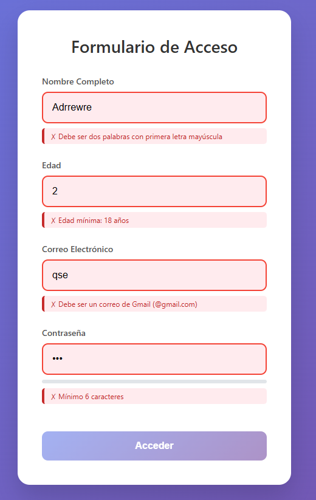

# Verificador de Datos
Verificador de varios campos como el nombre, la edad, la contraseña, y el correo

# 📖 Tabla de contenidos:
- [ Caracteristicas:](#caracteristicas)
- [ Instalacion:](#instalacion)
- [ Capturas:](#capturas)
- [ Tecnologias:](#tecnologias)
- [ Licencia:](#licencia)

# Caracteristicas:
- Verificador de 4 campos:
> >Nombre (Dos palabras, la primera de Ambas en mayusculas)
> >Edad (Entre 18 y 55)
> >Correo Electronico (Dominio obligatorio de @gmail.com)
> >Password (entre 6 y 25 caracteres, 6-10->debil, 11-20->robusta, 20-25->Muy robusta)
> >Login exitoso

# Instalacion:
```bash
git clone https://github.com/Adri-Coding-Dev/Verificador_Datos
cd Verificador_Datos
#Ejecuta el index.html en tu navegador favorito
```

# Capturas:
## Menu de pantalla incial

## Todo errores

## Todo correcto

## Acceso a la pagina


# Tecnologias:
>HTML5
>CSS3
>JavaScript

# Licencia:
Este proyecto esta bajo la licencia MIT